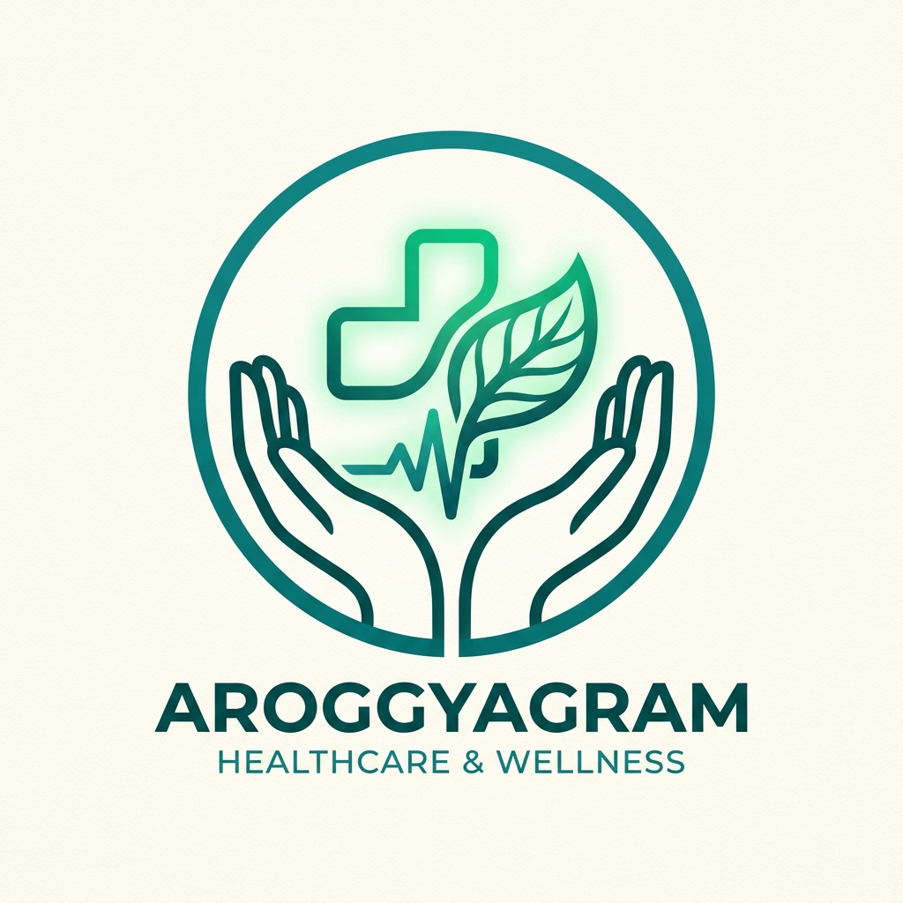
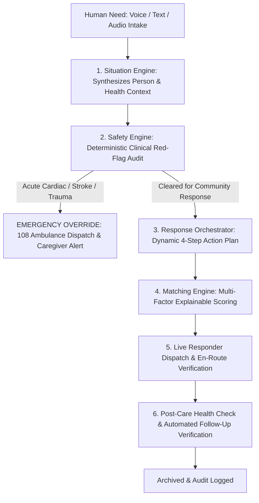

<div align="center">



# 🌿 AroggyaGram 3
### Intelligent Community Health-Response Network

**Turning unstructured human needs into coordinated real-world healthcare action.**

[](https://github.com/jvstin47/AroggyaGram-3/releases/tag/v1.0.0)
[](https://react.dev/)
[](https://capacitorjs.com/)
[](https://deepmind.google/technologies/gemini/)
[](https://vitest.dev/)
[](LICENSE)

<br/>

<a href="https://github.com/jvstin47/AroggyaGram-3/raw/main/AroggyaGram-v1.0.0-stable.apk">
  
</a>

<p align="center">
  <a href="#-download-and-install-apk">Direct APK Download</a> •
  <a href="#-core-vision--paradigm-shift">Core Vision</a> •
  <a href="#-the-care-case-lifecycle">Care Case Architecture</a> •
  <a href="#-key-capabilities">Key Capabilities</a> •
  <a href="#-pitch-deck--presentation">Pitch Deck (PPTX & PDF)</a> •
  <a href="#-getting-started">Getting Started</a>
</p>

</div>

---

## 📱 Download and Install APK

You can download and test the compiled native Android APK directly on any Android phone (Android 8.0+ / API 26 to Android 15):

* **Direct Repository Download (Immediate)**: [**`AroggyaGram-v1.0.0-stable.apk`**](https://github.com/jvstin47/AroggyaGram-3/raw/main/AroggyaGram-v1.0.0-stable.apk)
* **GitHub Release Page**: [View Release v1.0.0](https://github.com/jvstin47/AroggyaGram-3/releases/tag/v1.0.0)

### Installation via ADB (Fastest for Developers)
```bash
adb install -r AroggyaGram-v1.0.0-stable.apk
adb shell am start -n org.aroggyagram.app/org.aroggyagram.app.MainActivity
```

### Installation via Phone
1. Open the download link on your Android device.
2. Tap the downloaded `.apk` file.
3. Allow *Install unknown apps* for your browser if prompted, and tap **Install**.

---

## 💡 Core Vision & Paradigm Shift

Most healthcare apps fail rural communities because they operate in silos:
* A chatbot that provides text advice but cannot mobilize hands to bring medicine.
* An errand board that treats critical insulin refills like grocery delivery.
* An emergency SOS app that only sounds an alarm without clinical triage.
* A medicine reminder that alerts the patient but has no escalation when they are incapacitated.

**AroggyaGram solves this with a unified paradigm:**

> **The primary entity is not a database errand or a chat log — it is a first-class `Care Case`.**
> AroggyaGram continuously executes the closed loop:
> `UNDERSTAND → ASSESS → DECIDE → CONNECT → RESPOND → FOLLOW UP`.



---

## 🔄 The 10-Stage Care Case State Machine

Every community health request transitions through an audited, deterministic 10-stage state machine:

```
DRAFT ──► ANALYZING ──► ASSESSED ──► ACTION_REQUIRED ──► MATCHING ──► ASSIGNED
                                           │
                        (Emergency bypass) ├──► ESCALATED (108 Dispatch)
                                           │
 IN_PROGRESS ──► COMPLETED ──► FOLLOW_UP ──► RESOLVED
```

| State | Role in System | Actor |
| :--- | :--- | :--- |
| **`DRAFT`** | Initial intake recording in colloquial speech | Resident / Caregiver |
| **`ANALYZING`** | Situation Engine synthesizes person facts & symptoms | AI + Local NLP |
| **`ASSESSED`** | Deterministic clinical triage classifies risk (`LOW` → `CRITICAL`) | Safety Engine |
| **`ACTION_REQUIRED`**| Multi-step response plan generated; awaiting match | Orchestrator |
| **`MATCHING`** | Real-time geospatial search for verified first responders | Matching Engine |
| **`ASSIGNED`** | Volunteer confirms assignment with "Why this match?" audit | Volunteer |
| **`IN_PROGRESS`** | Responder en-route to pharmacy, clinic, or patient home | Volunteer / Health Worker |
| **`COMPLETED`** | Physical aid delivered; vitals & delivery verified | Volunteer |
| **`FOLLOW_UP`** | Post-care checklist verifies symptom relief & comfort | Caregiver / System |
| **`RESOLVED`** | Case safely closed and archived into regional health record | System |
| **`ESCALATED`** | Acute medical collapse bypasses volunteers to 108 emergency | Emergency Services |

---

## ✨ Key Capabilities

### 1. Natural Language Intake ("Tell us what is happening")
* Voice-first and text intake allowing citizens to speak naturally in **Malayalam, Hindi, Tamil, Bengali, or English**.
* Live Situation Engine extracts:
  * **Person Context**: Name, age, living situation (*lives alone, elderly spouse*), mobility level, vulnerability index (0–100).
  * **Health Context**: Chronic conditions, current medications, reported symptoms, baseline vitals.
  * **Immediate Need**: Category, constraints (*no stairs, auto-rickshaw accessible road*), and urgency.

### 2. Deterministic Safety Engine (Anti-Hallucination Guardrails)
* **Zero clinical hallucinations**: Hard-coded deterministic rules execute *before* or *parallel* to conversational AI.
* Detects acute red flags:
  * **Cardiac**: Chest pain, crushing pressure radiating to arm or jaw.
  * **Neurological / Stroke (FAST)**: Facial droop, arm weakness, slurred speech, syncope.
  * **Respiratory**: Severe dyspnea, choking, stridor.
  * **Trauma / Falls**: Falls with inability to stand, arterial bleeding.
* **Strict Rule**: Acute triggers **never** divert to untrained volunteers. They bypass matching and directly initiate **108 Emergency Ambulance Dispatch** + family caregiver alerts.

### 3. Multi-Factor Explainable Matching
Instead of a simple distance radius, the Matching Engine scores candidates across 5 weighted dimensions:
* **Proximity (40%)**: Geospatial distance from patient home.
* **Verified Skills (25%)**: Certified First Responder, Wheelchair Assist, Two-Wheeler Owner.
* **Availability (15%)**: Real-time status and active task load.
* **Language Match (10%)**: Native language compatibility (e.g. Malayalam fluency).
* **Historical Reliability (10%)**: Task completion rate and community rating.
* Generates a transparent **"Why this match?"** explainability card for every dispatch.

### 4. Care Case Mission Control
* A high-contrast command center for every active situation displaying:
  * **Who**: Full vulnerability score, living arrangement, emergency caregiver contacts.
  * **What & Risk**: Clinical triage card with color-coded risk meter (`LOW` / `MODERATE` / `HIGH` / `CRITICAL`) and constraints.
  * **Where**: Address, GPS coordinates, and nearest healthcare facilities with 1-tap call.
  * **Response Plan**: Step-by-step progress cards (*Safety Clear → Match Volunteer → Deliver Refill → Post-Care Check*).
  * **Live Responders**: Direct phone call trigger, status transitions (*Mark En Route*, *Mark Delivered*).
  * **Follow-up Checklist**: Post-resolution verification (*Did dizziness subside? Were correct medicines received?*).
  * **Unified Audit Log**: Chronological real-time timestamped event log.

### 5. Community Response Simulator
* Built-in interactive testbed allowing health coordinators and evaluators to stress-test community networks:
  * **Sliders**: Active Volunteers (5 to 100), Service Radius (2 to 25 km), Incident Load (10 to 100 cases).
  * **Environmental Constraints**: Clear Weather, Monsoon Flooding / Waterlogging, Late Night.
  * **Real-time Diagnostics**: Calculates average arrival time, cluster coverage rate (%), 108 emergency dispatch latency, and volunteer fatigue alerts.

### 6. Universal Emergency SOS
* Persistent floating 1-tap SOS button accessible from every screen.
* Non-blocking GPS acquisition with instant fallback to nearest registered address if satellite fix is obstructed.
* Pre-formatted emergency SMS dispatch with live Google Maps coordinate links.

---

## 🏗️ Technical Architecture & Tech Stack

```
src/
├── app/                  # Router & application configuration
├── components/           # Reusable UI, AppShell, TopHeader, DrawerMenu
│   ├── emergency/        # GlobalSOSButton overlay
│   └── layout/           # AppShell, TopHeader, DrawerMenu, BottomNav
├── features/
│   ├── care-cases/       # Mission Control, Intake Modal, Case Directory
│   ├── simulator/        # Community Response Network Simulator
│   ├── ai/               # Ask Aroggya clinical consultation screen
│   ├── medications/      # Daily adherence tracking checklist
│   ├── facilities/       # Leaflet facilities locator with 1-tap dial
│   ├── timeline/         # Unified chronological health events
│   └── news/             # Curated community health news with photos
├── services/
│   ├── ai/               # Situation Engine & Gemini 2.5 Flash client
│   ├── safety/           # Deterministic Safety Engine & clinical rules
│   ├── orchestration/    # Response Orchestrator & state machine
│   ├── matching/         # Multi-factor explainable scoring engine
│   ├── emergency/        # GPS formatting & emergency SMS services
│   └── supabase/         # PostgreSQL client with offline fallback
└── types/
    ├── careCase.types.ts # Care Case, PersonContext, HealthContext, State Machine
    ├── ai.types.ts       # RiskLevel & clinical guidance schemas
    └── database.types.ts # 22 relational database entities
```

| Layer | Technologies Used |
| :--- | :--- |
| **Frontend Framework** | React 19, TypeScript, Vite 5 |
| **Styling & Design** | Tailwind CSS v4, Lucide Icons, Custom Rural High-Contrast Theme |
| **Mobile Runtime** | Capacitor 6 (Native Android Packaging, `org.aroggyagram.app`) |
| **AI & NLP** | Google Gemini 2.5 Flash + Deterministic Local Clinical Heuristics |
| **State Management** | TanStack Query v5 + Selective React Context |
| **Geospatial & Maps** | Leaflet, React-Leaflet, OpenStreetMap |
| **Database & Auth** | Supabase PostgreSQL with Row Level Security |
| **Test Suite** | Vitest (Automated pipeline & safety validation) |

---

## 🧪 Automated Testing & Verification

The core decision pipelines are verified using automated unit tests:
```bash
npx vitest run
```

```
✓ src/__tests__/care_case_pipeline.test.ts (3 tests)
  ✓ SafetyEngine deterministically flags acute triggers and mandates 108 emergency dispatch
  ✓ SituationEngine extracts structured person, health, and need contexts from colloquial speech
  ✓ ResponseOrchestrator generates appropriate multi-step response plan and advances state machine

✓ src/__tests__/safety_and_routing.test.ts (4 tests)
  ✓ should detect emergency keywords deterministically and never allow volunteer diversion
  ✓ should route non-critical tasks to the volunteer assistance pathway
  ✓ should format emergency SMS correctly with and without GPS location
  ✓ should compute explainable matching scores with distance, verified skills, and reliability

Test Files  2 passed (2)
Tests       7 passed (7)
```

---

## 📊 Pitch Deck & Presentation

A cohesive 8-slide pitch deck designed in the signature warm-cream and deep-teal aesthetic of AroggyaGram is available directly in the repository:

* 📄 [**`AroggyaGram_Pitch_Deck.pdf`**](AroggyaGram_Pitch_Deck.pdf) — Ready for quick viewing, printing, or projection.
* 📽️ [**`AroggyaGram_Pitch_Deck.pptx`**](AroggyaGram_Pitch_Deck.pptx) — Fully editable Microsoft PowerPoint presentation with native vector styling and app theme tokens.

---

## 🚀 Getting Started (Development Setup)

### 1. Clone the Repository
```bash
git clone https://github.com/jvstin47/AroggyaGram-3.git
cd AroggyaGram-3
```

### 2. Install Dependencies
```bash
npm install
```

### 3. Environment Configuration (Optional)
Copy `.env.example` to `.env`:
```bash
cp .env.example .env
```
*(The app runs fully in offline/mock mode with realistic Kerala community scenarios if no API keys are provided!)*

### 4. Run Web Development Server
```bash
npm run dev
```

### 5. Compile Android APK
```bash
# Build web bundle
npm run build

# Sync assets with native Android project
npx cap sync android

# Compile debug APK with Gradle
cd android && ./gradlew assembleDebug
```
The output APK is generated at `android/app/build/outputs/apk/debug/app-debug.apk`.

---

## 🛡️ Clinical & Safety Disclaimer

AroggyaGram is a community-first assistance and preliminary triage system. AI symptom guidance is advisory and educational only and does not replace certified clinical diagnoses or emergency medical care. In any acute medical emergency, the system routes users directly to emergency ambulance services (**108 / 112** in India).

---

## 📄 License

This project is open-source software licensed under the **[MIT License](LICENSE)**.
